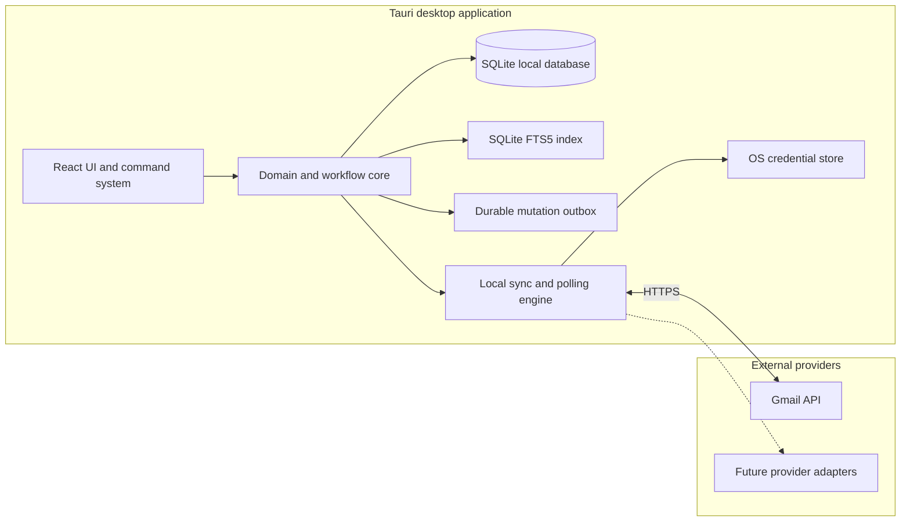

# Product and architecture plan

**Status:** Proposed  
**Last reviewed:** 2026-03-05

## 1. Executive summary

The product should not be framed as “Gmail with a different skin.” Its promise
is:

> Process important email at the speed of thought, without losing follow-ups,
> context, or control of your data.

The product is inspired by some of the best email clients available: combining
speed, deliberate keyboard workflows, focused triage, and safeguards against
dropped work. AI-assisted writing, intelligent triage, and collaboration are
valuable later additions. Matching a competitor's feature list is less
important than building a complete, trustworthy, low-latency workflow.

The recommended product is a standalone, local-first Tauri desktop application.
It stores mail in local SQLite, keeps OAuth credentials in the operating
system's keychain, and connects directly to Gmail. It requires no
project-operated backend. Start with Gmail, one account, and individual
workflows. Design a provider boundary from day one, but do not implement Gmail,
Microsoft Graph, and IMAP simultaneously.

## 2. Key value propositions

### 2.1 Speed as a product feature

The user can read, reply, archive, snooze, search, and navigate without taking
their hands off the keyboard. Optimistic updates and a local cache make actions
feel instantaneous even on a poor connection.

This is more than shortcuts. It requires:

- predictable shortcuts across every screen;
- a command palette that makes functionality discoverable;
- prefetching the next likely conversation;
- no blocking network call in an interactive path;
- undo rather than confirmation dialogs for reversible actions; and
- tight latency budgets with measurement in production.

**Success signal:** a practiced user can process a representative inbox at
least twice as fast as in their previous client.

### 2.2 Focused triage instead of one undifferentiated inbox

Split Inbox separates VIPs, team mail, notifications, newsletters, or arbitrary
search criteria. It lets users process categories in batches and protects
important messages from high-volume noise.

An open-source implementation should begin with deterministic rules that users
can inspect. AI classification can be added as an explicit, confidence-scored
rule type rather than becoming an invisible source of truth.

**Success signal:** important conversations are answered sooner, with a low
rate of incorrectly hidden mail.

### 2.3 Inbox zero as a reliable workflow

Archive, snooze, send later, reminders, and “remind me if nobody replies”
convert the inbox from storage into a work queue. Follow-up reminders are
especially valuable because they track whether the conversation received a
qualifying reply, not merely whether a timer elapsed.

**Success signal:** users can clear the inbox without maintaining a parallel
task list for email follow-ups.

### 2.4 Faster, higher-quality responses

Snippets, autocomplete, quick replies, polished composition, thread summaries,
and context-aware draft generation reduce repetitive work. AI is valuable when
it is fast, editable, grounded in the visible thread, and optional.

**Success signal:** lower median compose time without an increase in edits,
regretted sends, or privacy concerns.

### 2.5 Context where the user acts

Contact history, calendar availability, scheduling, and attachment previews
reduce application switching. Team comments and shared drafts bring internal
discussion next to an external conversation without leaking comments to email
recipients.

**Success signal:** fewer context switches and forwarded-email discussion
loops.

### 2.6 A premium-feeling, trustworthy experience

The best email clients also create confidence through careful visual design,
onboarding, offline support, undo send, and reliable synchronization. Privacy,
inspectability, local-first storage, and operation without a third-party
application backend are additional open-source differentiators.

**Success signal:** users trust the client as their primary inbox, not as an
occasional secondary view.

## 3. Product scope

### Initial target user

An individual power user with one Google Workspace or Gmail account who spends
at least an hour per day in email and prefers keyboard workflows.

### MVP: prove the core loop

1. Google OAuth and incremental Gmail synchronization.
2. Conversation list and thread reader with sanitized HTML.
3. Compose, reply, forward, drafts, attachments, and undo send.
4. Archive, trash, star, mark read/unread, labels, and batch actions.
5. Complete keyboard navigation and searchable command palette.
6. Local search over synchronized headers and message bodies.
7. Deterministic Split Inbox rules.
8. Snooze and follow-up reminders.
9. Snippets.
10. Offline read, draft, and queued mutation support.

### Next

- multiple accounts and unified inbox;
- send later;
- unsubscribe and sender blocking;
- calendar sidebar and availability sharing;
- Microsoft 365 through Microsoft Graph;
- optional AI summarize, draft, rewrite, and classification;
- mobile companion;
- shared conversations, comments, and drafts; and
- generic IMAP/SMTP for providers that lack richer APIs.

### Explicit non-goals for MVP

- pixel-for-pixel imitation of any existing email client;
- generic IMAP, Exchange on-premises, or every Gmail edge case;
- autonomous AI sending;
- CRM integrations;
- organization administration, SSO, SCIM, or compliance certification;
- real-time collaboration; and
- read receipts/open tracking, which has privacy, reliability, and abuse
  implications and should require a separate product decision.

## 4. Architectural drivers

In priority order:

1. **Correctness:** never lose, duplicate, or send an email unexpectedly.
2. **Perceived latency:** local reads and optimistic writes under 100 ms at p95.
3. **Privacy and security:** keep mailbox data local and make every external
   integration explicit.
4. **Offline resilience:** normal reading and composition continue offline.
5. **Provider portability:** preserve provider semantics without reducing all
   providers to the least common denominator.
6. **Operability:** synchronization failures must be observable and repairable.
7. **Extensibility:** commands, rules, and AI providers need stable contracts.

## 5. Recommended architecture



### Why this shape

- **Standalone and local-first:** instant navigation, offline use, local search,
  privacy, and optimistic mutation are central product requirements. Users
  should not need an account with this project or operate server infrastructure.
- **Direct provider access:** the desktop application completes OAuth with PKCE,
  retrieves the token from the OS keychain, and calls Gmail over HTTPS. Gmail
  remains the source of truth; SQLite is a local cache and workflow store.
- **Polling while running:** the local sync engine reads Gmail history on an
  adaptive interval and after user activity. It performs a catch-up sync at
  startup and does no work while the application is closed.
- **Provider APIs before IMAP:** Gmail exposes stable history cursors, native
  threads, labels, and modern OAuth. IMAP remains valuable but introduces
  substantially different threading and sync behavior.

### Deliberate limitations

Without a continuously running backend:

- scheduled actions and reminders execute only while the application is
  running;
- mail and settings do not automatically synchronize between installations,
  although mail state still converges through Gmail;
- the client polls instead of receiving push notifications at a public webhook;
  and
- team comments, shared drafts, and other project-owned collaboration state are
  out of scope.

These are accepted initial constraints, not reasons to pre-build a backend. If
future validated features require always-on execution or shared
application-owned state, design that service separately at that time.

### Suggested technology baseline

This is a starting recommendation, not a permanent constraint:

| Area | Choice | Reason |
| --- | --- | --- |
| Monorepo | pnpm workspaces + Turborepo | Shared typed packages and simple OSS contribution |
| UI | React + TypeScript | Mature accessibility, editor, and virtualization ecosystem |
| Frontend build | Vite | Fast desktop webview build and development loop |
| Desktop | Tauri 2 | Native packaging, OS integration, and smaller footprint than Electron |
| Local data | SQLite with FTS5 | Transactions, migrations, full-text search, and durable queues |
| Credentials | Tauri Stronghold or OS keyring plugin | Keep OAuth tokens outside JavaScript and the mail database |
| Gmail access | Gmail REST API with OAuth 2.0 PKCE | Direct, supported access with incremental history |
| Contracts | TypeBox/JSON Schema | Runtime validation at provider and Tauri command boundaries |
| Telemetry | OpenTelemetry | Vendor-neutral traces, metrics, and logs |

Keep the domain and provider conformance tests runtime-neutral. If profiling
shows sync, MIME parsing, search, or cryptography to be a bottleneck, move that
bounded component to Rust rather than starting with two implementation
languages throughout the stack.

## 6. Component boundaries

Suggested workspace layout:

```text
apps/
  desktop/             React UI and Tauri shell
packages/
  domain/              Entities, commands, policies, and state transitions
  client-db/           Local schema, migrations, and repositories
  sync-engine/         Cursor management, merge logic, outbox processing
  provider-contract/   Capabilities and canonical provider types
  provider-gmail/      Gmail adapter
  commands/            Command registry, keymaps, and palette metadata
  rules/               Split Inbox parser and evaluator
  mime/                Parsing, rendering, quoting, and sanitization
  ui/                  Accessible reusable components and design tokens
  ai/                  Redaction, consent, prompts, and provider adapters
docs/
  adr/                 One architectural decision per record
```

Dependencies point inward: applications and adapters depend on domain
contracts; the domain never imports React, Tauri, Gmail, Graph, or a specific
AI SDK.

## 7. Core domain model

Use internal stable IDs and retain provider IDs separately.

- **Account:** identity, provider, scopes, sync state, capabilities.
- **Mailbox:** folder or label projection with provider semantics.
- **Thread:** conversation projection and participants.
- **Message:** immutable RFC message content plus mutable flags and labels.
- **Draft:** mutable composition state with local and provider revisions.
- **Attachment:** metadata, content locator, cache state, and malware status.
- **Contact:** normalized addresses, interaction stats, and optional profile.
- **Rule / Split:** deterministic predicate and ordered inbox projection.
- **Reminder:** trigger time, condition, lifecycle, and associated thread.
- **Snippet:** title, shortcut, body, variables, and ownership.
- **Mutation:** idempotent intended action in the durable outbox.
- **ProviderCursor:** mailbox history token plus last successful checkpoint.

Do not pretend Gmail labels and IMAP folders are identical. The canonical model
should expose common operations while every account advertises capabilities:

```ts
type ProviderCapabilities = {
  nativeThreads: boolean;
  labels: boolean;
  folders: boolean;
  push: boolean;
  scheduledSend: boolean;
  serverSearch: boolean;
  undoSend: boolean;
};
```

The UI queries capabilities and either changes the interaction honestly or
hides unsupported actions.

## 8. Synchronization and mutation model

### Initial synchronization

1. Complete OAuth with the narrowest scopes that support the enabled features.
2. Record the provider's initial cursor.
3. Fetch mailbox/label metadata and recent message metadata in bounded pages.
4. Prioritize visible inbox content, then hydrate bodies and older history.
5. Write each page and its next cursor in one local transaction.
6. Build the full-text index asynchronously.
7. Continue background backfill according to the user's retention setting.

### Incremental synchronization

While the application is running, poll Gmail history on an adaptive interval:
poll quickly after startup, resume, a local mutation, or recent incoming mail,
then back off while idle. Also sync immediately when the user requests it.

1. Ensure only one local sync runs per account.
2. Read changes after the durable cursor.
3. Normalize them into idempotent upserts/deletes.
4. Commit data and the new cursor atomically.
5. Publish local projection changes.
6. evaluate reminder cancellation and Split Inbox rules; and
7. refetch a bounded window if the cursor expired.

On application startup or system resume, run this flow before returning to the
normal polling interval. Poll failures use exponential backoff and respect
Gmail quota and `Retry-After` guidance.

### Local mutations

Every user action follows the same pipeline:

1. Create a mutation with a UUID idempotency key.
2. Apply its optimistic local projection in the same transaction.
3. Return control to the UI.
4. Send through the provider adapter when online.
5. Reconcile the authoritative provider result.
6. Retry transient failures with exponential backoff and jitter.
7. On a permanent conflict, revert or repair the projection and show an
   actionable error.

Per-account ordering is required where provider operations are order-sensitive.
Sending is never retried blindly: persist the provider request ID and reconcile
sent mail before another attempt.

### Undo send

Implement MVP undo send as a local delayed outbox, for example 10 seconds.
During the delay the message is cancelable and has not left the system. The
application must warn or briefly defer shutdown while a send is in this undo
window. A queued send that cannot complete remains durable and resumes the next
time the application runs.

## 9. Command and interaction architecture

Treat commands as the primary application API, not as UI event handlers:

```ts
type Command<Context = unknown> = {
  id: string;
  title: string;
  defaultKeys?: string[];
  when(context: Context): boolean;
  run(context: Context): Promise<CommandResult>;
  undo?: (result: CommandResult) => Promise<void>;
};
```

Buttons, keyboard shortcuts, menus, and the command palette invoke the same
command. This guarantees behavior parity and creates one place for analytics,
authorization, optimistic updates, undo, and error reporting.

Requirements:

- user-remappable keymap with collision detection;
- focus scopes so editor shortcuts do not trigger inbox actions;
- WCAG-compliant list and dialog semantics;
- screen-reader announcements for optimistic changes and undo;
- keyboard-only automated acceptance suite; and
- development warnings when a visible action lacks a command.

## 10. Search and Split Inbox

Use local SQLite FTS5 for low-latency search over sender, recipient, subject,
and hydrated body text. Fall back to provider search for uncached history and
merge results by provider identity.

Define Split Inbox rules with a versioned abstract syntax tree, not raw provider
query strings:

```text
and(
  from.domain("example.com"),
  not(header.listUnsubscribe.exists()),
  received.within("30d")
)
```

The rule engine compiles this AST to local predicates and, where possible,
provider queries. Explain why each message matched. Later, an AI classifier can
be one predicate with a model version, confidence threshold, and deterministic
fallback.

## 11. AI architecture

AI must be optional and behind a provider-neutral interface:

- local model, user-supplied API key, or hosted service;
- feature-level consent for summary, drafting, search, and classification;
- a preview of the exact context categories being shared;
- thread text treated as untrusted input to limit prompt injection;
- structured outputs validated before use;
- citations back to source messages for factual summaries;
- no training on mailbox data by default; and
- cached outputs keyed by content hash, model, and prompt version.

AI may propose a draft or classification. It must not send, delete, change
permissions, or follow instructions embedded in an email without a distinct,
user-confirmed command.

## 12. Security and privacy

Email is hostile input and highly sensitive data.

- Use OAuth Authorization Code with PKCE and narrow, incremental scopes.
- Store refresh tokens in the OS keychain; never expose them to the React
  webview or store them in SQLite.
- Perform token exchange, refresh, and authenticated Gmail requests in the
  trusted Tauri layer rather than browser JavaScript.
- Sanitize HTML with an allowlist, isolate rendered mail, block scripts and
  forms, and require consent for remote images.
- Prevent tracking pixels by default and warn before external navigation.
- Scan attachment downloads where a configured scanner is available.
- Encrypt transport everywhere and document what is and is not encrypted at
  rest.
- Make local retention configurable and provide account data deletion.
- Protect the loopback or custom-URI OAuth callback against CSRF with `state`
  and PKCE, and prevent other applications from injecting authorization codes.
- Add dependency scanning, secret scanning, signed releases, an SBOM, and a
  private vulnerability reporting process before public beta.

End-to-end encryption is not promised by this design: providers can read normal
email, and anyone with access to an unlocked local profile may be able to read
the local cache. Claims in the UI and documentation must state this plainly.

## 13. Desktop trust boundaries

React invokes a narrow set of typed Tauri commands rather than receiving OAuth
tokens or unrestricted filesystem/network access:

```text
account.connect()
account.sync()
thread.archive()
thread.snooze()
draft.save()
draft.send()
```

The trusted layer owns keychain access, SQLite, Gmail HTTP requests, MIME and
attachment filesystem operations, and mutation execution. Validate every
command payload at the boundary and grant only the Tauri capabilities each
window requires. Domain commands still create idempotent local mutations before
provider access.

## 14. Reliability and observability

Define service-level indicators before optimization:

| Indicator | Initial target |
| --- | --- |
| Local command acknowledgement | p95 < 100 ms |
| Cached thread open | p95 < 150 ms |
| Warm application interactive | p95 < 1.5 s |
| Poll-discovered mail to local projection while active | p95 < 60 s |
| Successful mutation convergence | 99.9% within 60 s |
| Duplicate sends caused by the client | 0 |
| Crash-free sessions | > 99.8% |

Trace one correlation ID from command through local mutation and provider
request. Metrics must avoid subjects, addresses, body content, and attachment
names. Telemetry is opt-in. Provide a user-visible sync diagnostics screen with
cursors, queue state, redacted recent errors, and a safe “repair account”
workflow.

## 15. Test strategy

The sync engine is the highest-risk subsystem.

1. **Unit tests:** command policies, MIME quoting, address normalization, rule
   evaluation, merge logic, and reminder conditions.
2. **Contract tests:** run every provider adapter against the same capability
   suite.
3. **Recorded provider tests:** replay redacted API fixtures, expired cursors,
   repeated history entries, rate limits, and malformed MIME.
4. **Property tests:** duplicate/reordered events converge to the same state;
   retries never create a second send.
5. **Integration tests:** temporary SQLite databases plus a fake provider and
   fake clock for polling, undo send, snooze, and reminders.
6. **End-to-end tests:** keyboard-only inbox processing, offline compose,
   reconnect, undo send, and OAuth recovery.
7. **Performance tests:** 100k-message local database, large threads, attachment
   pressure, and sync storms.
8. **Security tests:** HTML/MIME corpus, malicious links, OAuth CSRF, keychain
   isolation, Tauri capabilities, and command-boundary validation.

Use fault injection early: terminate the process between provider success and
local commit, repeat history entries, expire tokens, and reorder changes.

## 16. Delivery plan

### Phase 0 — foundations (2–3 weeks)

- choose project name, license, contribution model, and governance;
- validate Gmail restricted-scope and OAuth verification requirements;
- create desktop workspace, CI, release signing, SQLite migrations, and ADR
  templates;
- prototype PKCE login with keychain-backed token storage;
- prototype Gmail history sync into SQLite; and
- benchmark virtualized list and cached thread rendering.

**Exit:** technical spikes demonstrate the latency budget and correct recovery
from duplicate history entries, expired cursors, and application restart.

### Phase 1 — read and triage (4–6 weeks)

- authentication, initial/incremental sync, list, reader, local search;
- adaptive polling, startup/resume catch-up, and manual refresh;
- archive/read/star/label mutations with optimistic UI;
- command registry, shortcut help, palette, and undo framework; and
- HTML sanitization, remote-image policy, diagnostics, and crash reporting.

**Exit:** team members can use it as a reliable read/triage client for two
weeks without data-loss incidents.

### Phase 2 — compose and workflow (4–6 weeks)

Detailed correspondence implementation: [compose, drafts, safe sending, attachments, and keyboard integration](docs/phase-2-compose.md).

- draft, reply, forward, attachment upload, and safe send;
- delayed undo send, snooze, conditional follow-up, snippets;
- deterministic Split Inbox and offline mutation queue; and
- accessibility and large-mailbox performance passes.

**Exit:** target users can complete the entire daily email loop and recover
cleanly from offline and token-expiry scenarios.

### Phase 3 — hardening and public alpha (3–5 weeks)

- installer/update path, import/export, retention controls;
- threat model, external security review, telemetry consent;
- provider quota/load tests and operational runbooks; and
- contributor documentation and stable extension contracts.

**Exit:** reproducible signed builds, documented local backup/restore, and no
known critical security or sync correctness issue.

### Phase 4 — expand based on evidence

Add multiple accounts, Microsoft Graph, calendar, and AI in that order only if
usage research supports it. Generic IMAP follows once the threading and folder
UX is explicitly designed, not merely adapted from Gmail. Mobile,
cross-device application settings, collaboration, or reliable execution while
all clients are closed each require a separate architecture decision and may
justify an optional service later.

## 17. Decisions to make before implementation

1. **License:** permissive (Apache-2.0) or reciprocal (GPL-3.0)?
   Recommendation: Apache-2.0 to encourage provider adapters and desktop
   contributions, unless preventing proprietary redistribution is a core
   governance goal. Confirm with counsel.
2. **Gmail OAuth registration:** project-provided client ID or require users to
   configure their own?
   Recommendation: provide an official client ID in signed releases, while
   allowing custom credentials for independently distributed builds.
3. **Local database encryption:** rely on full-disk encryption or add
   application-level encryption?
   Recommendation: document full-disk encryption as the initial requirement
   and evaluate SQLCipher before public beta based on its key-management and
   distribution costs.
4. **AI default:** local, bring-your-own-key, or hosted?
   Recommendation: no AI dependency in MVP; begin with bring-your-own-key and
   local adapters after the core workflow is reliable.
5. **Read tracking:** include or reject?
   Recommendation: omit by default. Tracking pixels are unreliable and work
   against the project's privacy differentiation.

## 18. Principal risks

| Risk | Mitigation |
| --- | --- |
| Gmail OAuth restricted-scope verification delays launch | Validate scopes in Phase 0 and allow custom OAuth credentials in independent builds |
| Sync bugs damage trust | One mutation pipeline, idempotency, cursor transactions, fault injection, diagnostics |
| “Multi-provider” abstraction leaks | Capability model, provider-native IDs, shared conformance suite |
| Local databases grow without bound | Configurable cache window, body/attachment eviction, index compaction |
| Polling consumes quota or feels stale | Adaptive polling, manual refresh, quota metrics, startup/resume catch-up |
| Laptop sleep delays reminders and queued sends | Make the limitation visible and execute overdue work on resume |
| AI creates privacy or correctness incidents | Opt-in adapters, context preview, validated outputs, no autonomous send |
| Feature parity delays useful release | Gate phases on the daily core loop, not competitor checklist parity |

## 19. Research basis

The product definition draws on publicly documented patterns across leading
email clients: keyboard-driven processing, categorized inboxes, follow-up
reminders, snippets, delayed send, local caching, AI assistance, and team
collaboration. The architecture and implementation are independent and use
their own code, identity, assets, and product language.
