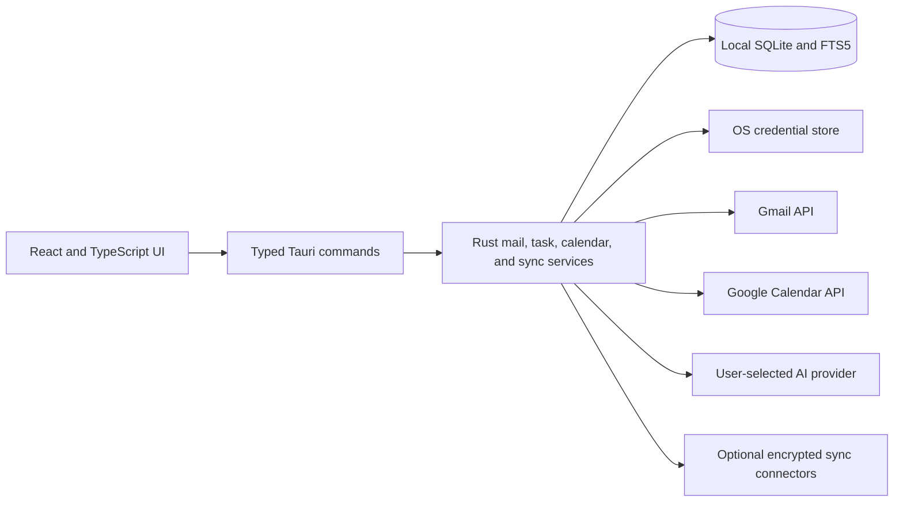

# ThreeStrands product plan

**Status:** Current product baseline and forward-looking roadmap
**Reviewed:** 2026-10-02 against the 0.55.1 codebase
**Contact capabilities updated:** 2026-10-08 for 0.83.0

## Product direction

ThreeStrands is a source-available, keyboard-first desktop email client for people
who spend much of their day in their inbox. Its aim is to make important
conversations easy to process while keeping follow-ups, scheduling context, and
control of personal data close to the mail itself.

Project licensing is governed by the [PolyForm Perimeter License 1.0.1](LICENSE).
The source can be inspected, built, used, and modified for permitted purposes;
providing others with a competing product built from it is prohibited.

The product is local-first. The desktop app connects directly to Gmail; it does
not require a ThreeStrands account or an application-operated mail backend.
Mail is cached in SQLite for fast reading, search, and offline work. Gmail
remains the source of truth for mail. The app stores OAuth credentials in the
operating system's credential store and sends mail through a durable local
outbox. Optional AI sends bounded mail context to a provider the user
configures. Optional cross-device sync replicates selected
workflow data through storage the user chooses.

This document distinguishes implemented behavior from future work. “Available”
means present in the repository, with automated coverage; it is not a claim
that every native integration has completed live-account or release
validation. The older phase plans linked below are useful implementation
history, but their milestone labels and uncompleted-item lists are no longer
the product status.

## Current feature set — website draft

This section is written at the level of a future product website. It describes
features in the current desktop app without promising a release date, a
particular platform package, or always-on service behavior.

### Move through mail quickly

- Navigate conversations, messages, accounts, and views from the keyboard.
  Use a command palette and shortcut help to discover actions.
- Read and triage multiple Gmail accounts in one merged view, or focus on one
  account. Archive, restore, trash, mark as spam, mark read or unread, star,
  label, and process selected conversations in batches, with undo for
  reversible actions.
- Search the local mail index; when relevant mail is outside the cache, Gmail
  search can bring older results into the local view. Filter the mailbox by
  unread, starred, important, or unanswered conversations.
- Create account-specific Split Inboxes using a sending domain, Gmail label,
  or address pattern. Keep high-volume mail in its own view while the main
  inbox stays focused.

### Keep the whole conversation moving

- Compose, reply, reply all, and forward with rich text, attachments, and
  reusable snippets. Recipient suggestions come from correspondence history
  and addresses pinned in the composer.
- Drafts save locally. A queued send has a ten-second undo window, and the
  durable outbox preserves pending work across restarts. Sent mail is
  reconciled with Gmail when the delivery result is uncertain.
- Turn a conversation into an action, follow-up, or waiting-for task; create
  standalone tasks too. Set due dates and repeating follow-ups. Waiting and
  follow-up tasks linked to a conversation can complete when a new reply
  arrives.
- Browse, add, and edit contacts outside the composer, with multiple addresses,
  notes, profile details, correspondence history, groups, birthdays, and Keep in
  Touch reminders. Import and export CSV/vCard address books, explicitly merge
  saved profiles, and reversibly hide addresses from recipient suggestions on
  this device. See [contact management](docs/address-book.md) for merge rules,
  interchange limits, and sync boundaries. A conversation context panel brings
  people, related tasks, and meetings beside the message.
- Unsubscribe when a message advertises a supported unsubscribe method, with
  confirmation before the request.

### Bring schedule and assistance into context

- Connect Google Calendar separately from mail. See today's schedule or a
  week view, choose visible calendars, preview calendar invitations, and
  check available times against selected calendars and working hours. Put
  selected times into a draft reply. Create events with invitees from the week
  view or a reviewed meeting suggestion, after checking the event dialog.
- Optionally connect an AI provider with your own API key for thread
  summaries, draft assistance, and suggested tasks or meetings. Suggested
  actions stay proposals until you review them; the app does not create a
  task or send a message from AI output on its own. Thread Chat can answer
  questions with selected readable attachments and explicitly requested mailbox
  search. Contact enrichment suggests profile details from correspondence for
  the user to apply. Proactive briefs require a separate opt-in; enabled briefs
  send qualifying conversations after the reader stays on them. Settings show
  requests, tokens, and estimated costs, with an optional fast model for
  summaries, reply drafts, and contact enrichment.

### Stay in control of local data

- Read cached mail and work on drafts while offline. Mail changes and sends
  queue locally and resume when the app can reach Gmail.
- Adjust local mail retention and remote-image loading. Sender HTML is
  sanitized and contained in a sandboxed reader; remote images stay behind
  the native proxy and the chosen image-loading setting.
- Transfer settings, account display metadata, saved contacts, snippets, and
  Split Inboxes with a password-encrypted export. Mail, drafts, queued sends,
  OAuth credentials, and AI keys are excluded; accounts need authorization on
  the new device.
- Inspect sync diagnostics and use opt-in crash reporting. Local database
  backups and startup recovery protect access when the cache is damaged.

**Encrypted sync:** End-to-end encrypted cross-device sync can replicate tasks,
goals, saved contacts, snippets, Split Inboxes, selected preferences, and account
display metadata through a shared folder, S3-compatible storage, or an IPFS connector. Devices
can join with a code, recovery phrase, or approval from another device.
Cached mail, attachments, drafts, queued sends, and provider credentials stay
on each device. See [cross-device sync](docs/cross-device-sync.md) for the
precise data boundary and connector behavior.

## Product roadmap — website draft

These are directions for unfinished product work, not a dated commitment or
an assertion that a feature is already in beta. Keep this section separate
from the current feature set when publishing a website.

| Direction | What users could expect |
| --- | --- |
| Snooze and scheduled sending | Put a conversation aside until a chosen time and queue a message for later delivery, with clear behavior when the desktop app is closed. |
| Sending aliases and signatures | Send from verified Gmail aliases, with a signature for each identity. |
| Drafts across devices | Start a reply on one computer and finish it on another, with clear controls over draft synchronization. |
| Connected address books | Import existing Google Contacts and keep them connected to local profiles, notes, and correspondence history. |
| Smarter inbox rules | Explore inspectable, user-controlled classification beyond today's domain, label, and address rules. |
| More mail providers | Add IMAP/SMTP (design in `docs/imap-design.md`), then Microsoft 365. Gmail is the only implemented mail provider today. |
| Encrypted sync reliability | Keep hardening optional encrypted sync across devices and app versions, especially upgrades and interrupted joins. |
| Shared and mobile workflows | Explore a mobile companion and shared conversations or drafts where demand justifies the additional architecture. |

The roadmap should be revised as research and reliability work change
priorities. Contact browsing and editing, meeting proposals, available-time
replies, and reviewed calendar-event creation exist today. Task follow-ups exist
today. Scheduled sending with one fixed sending device and synchronized
summary visibility is implemented; conversation snoozing remains planned.

## Current product model and decisions

### Audience and scope

The primary user is an individual who wants a fast daily mail workflow across
one or more Gmail accounts. Tasks, calendar context, and optional AI support
that workflow. ThreeStrands is not yet a general-purpose mail client: the
provider seam is implemented, but Gmail is its only production mail adapter.

The app does not operate a backend for mailbox access or cross-device sync.
Polling, task reconciliation, queued sends, and replication run while the
desktop app is active and catch up when it starts or resumes. A future feature
that needs execution while all devices are closed requires an explicit new
architecture decision; a scheduled-send UI alone would not provide it.

### Implementation shape

- Tauri 2 hosts the React/Vite interface. The Rust side owns provider calls,
  OAuth, credentials, SQLite, MIME and attachment handling, image fetching,
  and correspondence delivery. The browser development build uses fixtures;
  it does not deliver real mail.
- Gmail sync uses initial import, incremental History cursors, adaptive
  polling, startup/resume catch-up, and recovery when a cursor expires.
  Accounts have separate identities and sync state. Local mail actions use a
  durable mutation queue and reconcile with Gmail.
- Sending uses a separate durable outbox with immutable MIME snapshots,
  cancellation during the undo window, and explicit handling for uncertain
  delivery. Drafts and outbox records are local to an installation; they do
  not synchronize through Gmail Drafts or optional cross-device sync.
- The SQLite cache provides local full-text search, workflow records, and
  periodic backups. Settings include a local mail-retention policy. Provider
  data and application-owned workflow data have deliberately different sync
  boundaries.
- Split Inbox rules currently match a domain, label, or address pattern and
  are scoped to one account. Snippets are shared across accounts locally.
  Tasks can be standalone or linked to a thread; a new inbound reply can
  complete a linked waiting or follow-up task. AI action extraction offers
  reviewable proposals rather than directly mutating tasks or calendar.

### Security and privacy boundaries

- OAuth uses a desktop authorization flow with PKCE. Tokens and optional AI
  keys remain outside the webview and mail database, in the OS credential
  store. The app talks directly to Google and to an AI provider only when
  that integration is configured and used.
- Sender-authored HTML is untrusted. The reader sanitizes unsafe capabilities,
  preserves safe layout, and renders inside a sandboxed, CSP-scoped iframe.
  Remote images use the native proxy and can be blocked. Attachment operations
  stay behind native commands.
- The encrypted settings export contains a versioned, validated allowlist and
  deliberately excludes message content and secrets. Its format is persistent
  across app versions; changes require compatibility handling. See
  [settings transfer](docs/settings-transfer.md).
- Optional replicated sync is off by default and uses a user-chosen connector,
  not a ThreeStrands account. It carries only the application-owned data listed
  in [the sync guide](docs/cross-device-sync.md). Transport providers see
  ciphertext, although file sizes and timing remain visible to them.
- Local mail storage is not described as end-to-end encrypted. Gmail and
  recipients process ordinary email, and someone with access to an unlocked
  local profile may be able to read the cache.

## Work remaining before broader release

1. **Validate the native workflow end to end.** The repository has substantial
   automated unit, integration, and Playwright coverage. Earlier phase status
   documents explicitly leave live Gmail OAuth, synchronization, sending,
   attachment, and recovery checks to controlled real-account validation.
   Keep those checks as release gates until they are recorded as complete.
2. **Harden the current scope.** Continue testing large mailboxes, provider
   rate limits, offline/reconnect behavior, uncertain send outcomes, database
   recovery, and cross-device sync compatibility. Report progress in user
   terms rather than treating a feature's presence in code as proof of
   production reliability.
3. **Build the near-term roadmap deliberately.** Verify scheduled-send
   behavior around native sleep and shutdown; define snooze behavior before
   adding it.
   Extend the existing standalone address book with connected provider address
   books after defining ownership and conflict behavior.
   Mature replicated sync before presenting it as a standard feature.
4. **Expand integrations from tested contracts.** The Rust provider traits
   isolate Gmail-specific access. Add another provider only with its own
   threading, folder, search, mutation, and send semantics plus contract and
   fault-recovery tests. Keep AI optional and user-reviewed.

## Operating principles

1. Do not lose or duplicate mail or send it unexpectedly. Reconcile uncertain
   outcomes rather than retrying a send blindly.
2. Make common actions fast and keyboard-accessible. Keep typing scopes,
   dialogs, undo, and focus behavior predictable.
3. Treat email, attachment names, provider responses, and AI output as
   untrusted. Preserve safe sender layout without weakening the reader's
   isolation boundary.
4. Keep local, Gmail, AI-provider, and connector data boundaries explicit in
   both the product and its marketing claims.
5. Make offline, reconnect, failed mutation, and recovery states visible and
   repairable. Do not promise always-on execution from a desktop-only app.

## Source documents

- [Scheduled send plan](docs/scheduled-send-design.md) — fixed sending-device ownership, local scheduling, and encrypted summary visibility across devices; implemented in 0.98.1, with
  Command/Ctrl+Shift+L added in 0.98.2.
- [Design principles](DESIGN.md) — current keyboard, workspace, form, and AI
  review decisions.
- [Cross-device sync](docs/cross-device-sync.md) and [replicated sync design](docs/replicated-sync-design.md) — sync scope and trust model.
- [Settings transfer](docs/settings-transfer.md) and [email rendering policy](docs/email-rendering-policy.md) — persistent-format and reader boundaries.
- [Phase 1 status](docs/phase-1.md), [Phase 2 correspondence status](docs/phase-2-status.md), [multi-account plan](docs/multi-account.md), and [contact management](docs/address-book.md) — milestones and feature-specific context; the contact document describes current capabilities.
